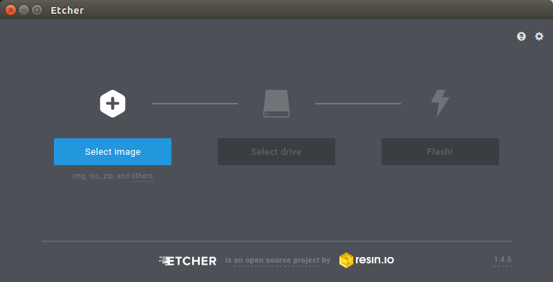
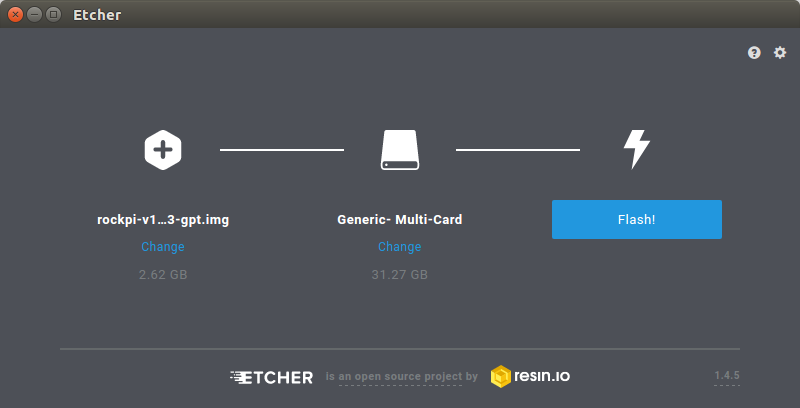
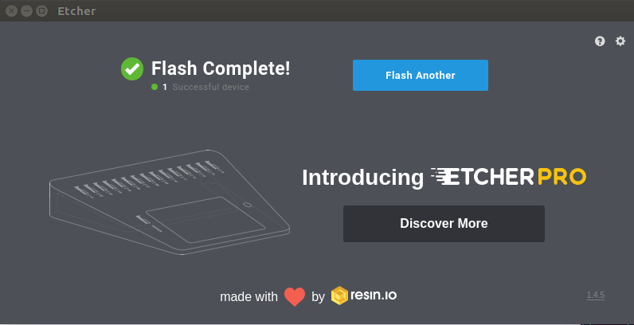

# Install System to microSD
* After unpacking the system image package, we run the tool by executing the command

 `./etcher-etcher-electron-1.4.5-x86_64.AppImage`

If you get an error message: "No polkit authentication agent found" you can try and start it with sudo, but do know that this is running the tool as '''root'''.
*  In the etcher window, click '''Select image'''.

* In the etcher window, click '''Select Drive'''.

* In the etcher window, click '''Flash'''.  
If you don't use the etcher's latest edition or you use corrupted image package, etcher may malfunction in this step.

* In the etcher window, once it shows us Flash Complete! It is done and can be put into the RockPi.

