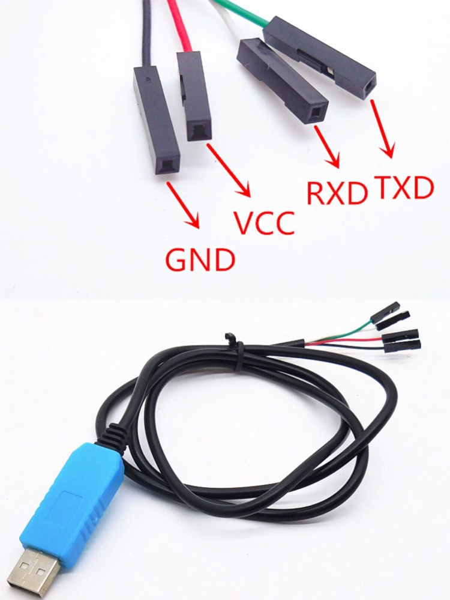

# Connect to Serial Console
***
ROCK 3 exports a dedicated serial console, which can access the low level debug message.
## Requirement 

* ROCK 3
* USB Type-C power adapter and USB Type-C charging data cable
* Host PC with Windows or Linux
* USB to TTL serial cable
  * The definition of each pin of USB to TTL cable is showing like this:



## Note 

* The default baudrate of ROCK 3 is 1500000(1.5Mbps), please check if your USB to TTL cable support 1.5Mbps baudrate. Some model of [CP210X](https://www.silabs.com/products/interface/usb-bridges) and [PL2303x](http://www.prolific.com.tw/US/ShowProduct.aspx?pcid=41)  have baudrate limitation,and the [FT232RL](http://www.ftdichip.com/Products/ICs/FT232R.htm) have some [ power issue](https://forum.radxa.com/t/u-boot-cant-boot-with-serial-console-attached/7684/)(20211112), please check the specified model. We also tested that some cable does not work well. Make sure choose a high quality one. The instructions below use a [CH340_series](http://wch-ic.com/products/CH340.html ) based cable.

* It seems that the serial tool on macOS platform can not support custom baudrate such as 1.5Mbps due to driver restriction. If you know how to set custom baudrate on macOS, please add an item here to show your findings.

## Connection 

Connect the USB to TTL serial cable as below. '''Don't connect the red wire.'''


| ! ROCK 3   | <---> | USB to TTL cable |
| ---------- | ----- | ---------------- |
| RX(pin 10) | <---> | Green wire       |
| TX(pin 8)  | <---> | White wire       |
| GND(pin 6) | <---> | Black wire       |


## Serial setting on host PC

The default serial setting for ROCK 3 u-boot and kernel console is:

```baudrate: 1500000
    data bit: 8
    stop bit: 1
    parity  : none
    flow control: none
```

## Linux 

Minicom is the serial tool that supports wide range baud rate.

Install minicom:

```sudo apt-get update
    sudo apt-get install minicom
```
Plug in the USB to TTL cable, kernel `dmesg | tail` should show the following device:

``` [1036835.654076] usb 1-6.4.3: new full-speed USB device number 103 using xhci_hcd
    [1036835.755730] usb 1-6.4.3: New USB device found, idVendor=0403, idProduct=6001
    [1036835.755732] usb 1-6.4.3: New USB device strings: Mfr=1, Product=2, SerialNumber=0
    [1036835.755733] usb 1-6.4.3: Product: USB <-> Serial
```